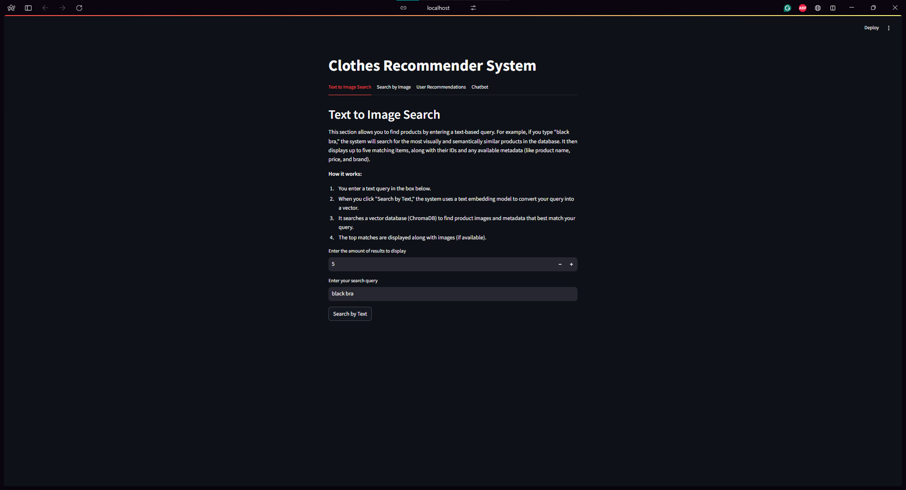
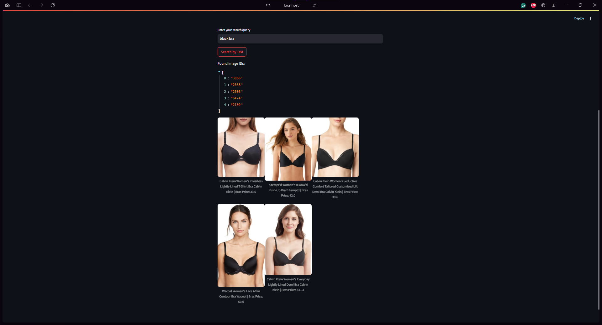
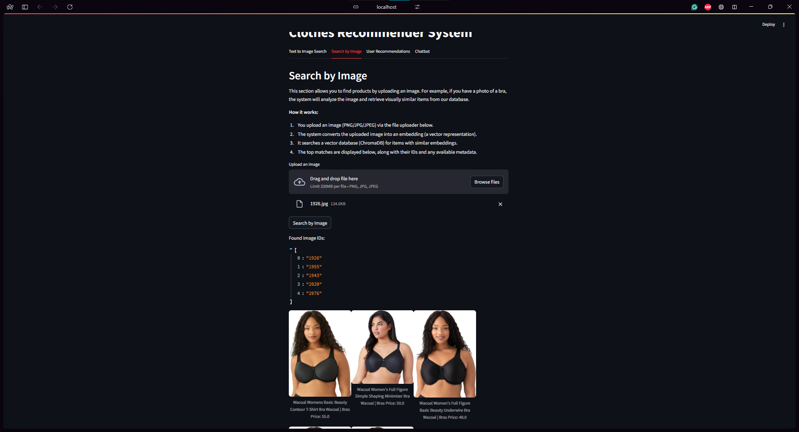
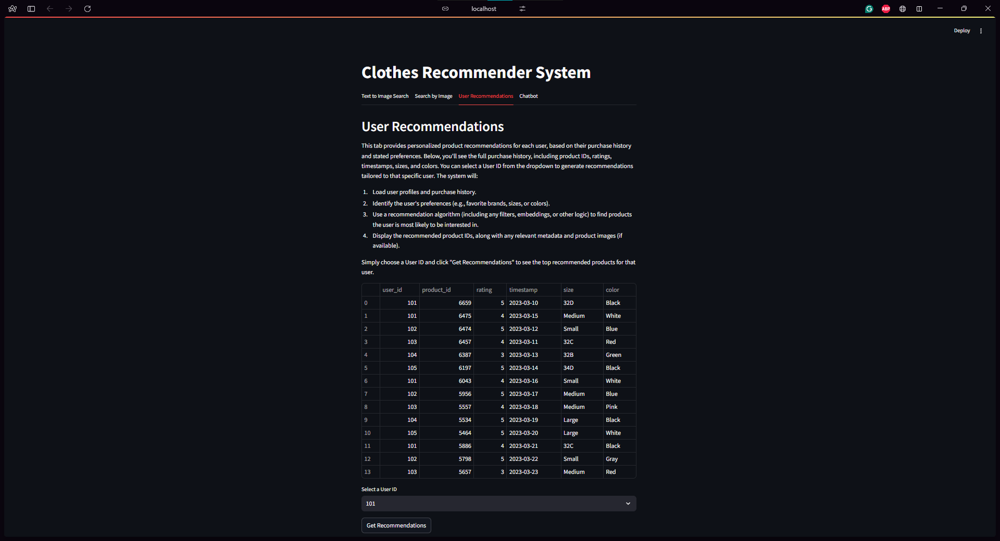
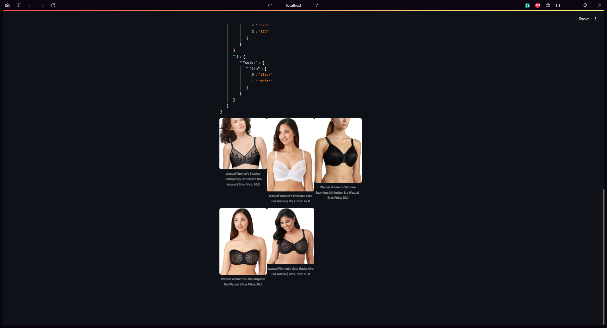
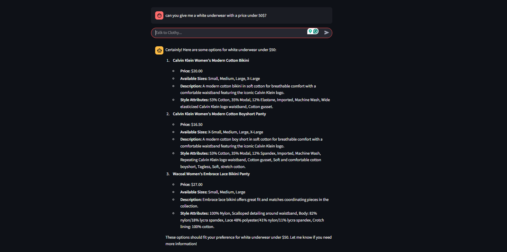
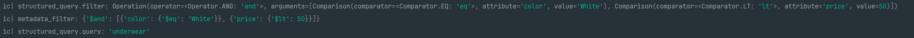
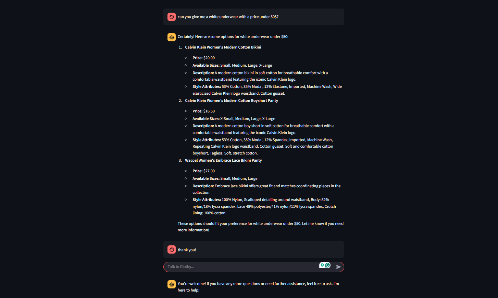

# Clothes Recommender System

A multimodal recommendation system for clothing products that uses a vector store, image/text embeddings, and a chatbot interface to deliver personalized product recommendations.

## Overview

The Clothes Recommender System is a Streamlit-based web application that:
- **Searches products by text:** Converts a user's text query (e.g., "black bra") into an embedding and retrieves visually similar products from the database.
- **Searches products by image:** Allows users to upload an image to retrieve similar products.
- **Generates user recommendations:** Leverages user profiles and purchase history to offer personalized product recommendations.
- **Offers a chatbot with self-query retrieval:** Uses natural language queries combined with metadata filters (via a self-query retriever) to help users find products and answer questions interactively.

The system utilizes:
- **ChromaDB** as a vector store,
- **OpenCLIP** for image embeddings,
- **LangChain** for self-query retrieval and chatbot functionality,
- **Streamlit** for the user interface.

## Features

- **Text-to-Image Search:** Enter a text query and view up to five matching product images with associated metadata.
- **Image Search:** Upload an image and retrieve similar products based on visual embeddings.
- **User Recommendations:** Get personalized recommendations based on user purchase history and preferences.
- **Chatbot & Self-Query Retrieval:** Interact with an AI chatbot that leverages self-query retrieval to answer product-related questions and perform metadata filtering.

## How it works

#### **Text-to-Image Search:**


#### **Image Search:**

#### **User Recommendations:**


#### **Chatbot & Self-Query Retrieval:**



## Installation

### Prerequisites

- Python 3.13

### Setup

1. **Clone the Repository:**

   ```bash
   git clone https://github.com/yo1am1/clothes_recommender.git
   cd clothes_recommender
   ```
   
2. **Create and Activate a Virtual Environment:** 

    ```bash
    python -m venv .venv
    source .venv/bin/activate  # On Windows: .venv\Scripts\activate
    ```
   
3. **Install the Required Packages:**

    ```bash
    pip install -r requirements.txt
    ```

4. **Data preparation (Optional)**
   #### I have included a sample dataset in the `data` folder (`images.rar` archive). I recommend using data from that archive, but if you want to use your own data, you can replace the data with your own.
   Run the following command to rebuild ChromaDB:
   ```bash
      python ./utils/data_processing.py --force
   ```
    
   This will load images from the internet and prepare the data for the vector store.
   
   Then run `image_embeddings.py` with this command:
      ```bash
         python ./utils/embeddings/image_embeddings.py
      ```

5. **Run the application**:   
   ```bash
      streamlit run chatbot_streamlit.py
   ```
   ```bash
      fastapi run chatbot_fastapi.py
   ```
6. **FastAPI endpoint with user recommendations**:
   Go to `127.0.0.1:8000/docs` and try `/recommend` endpoint
